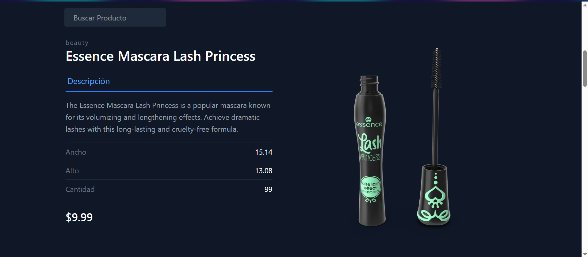
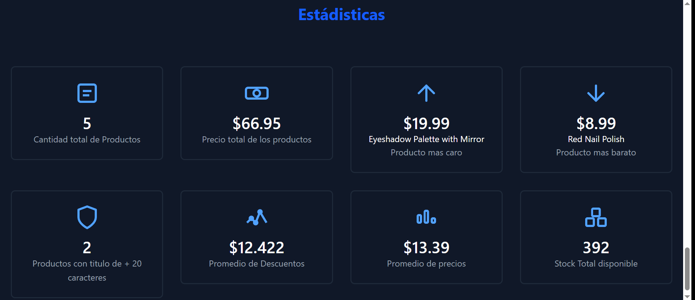
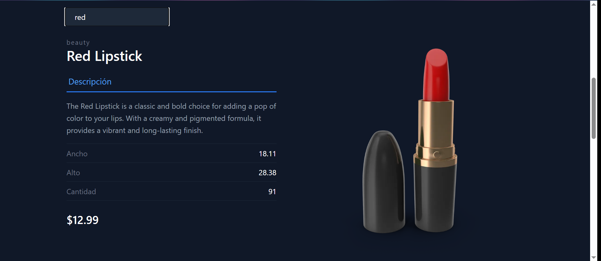
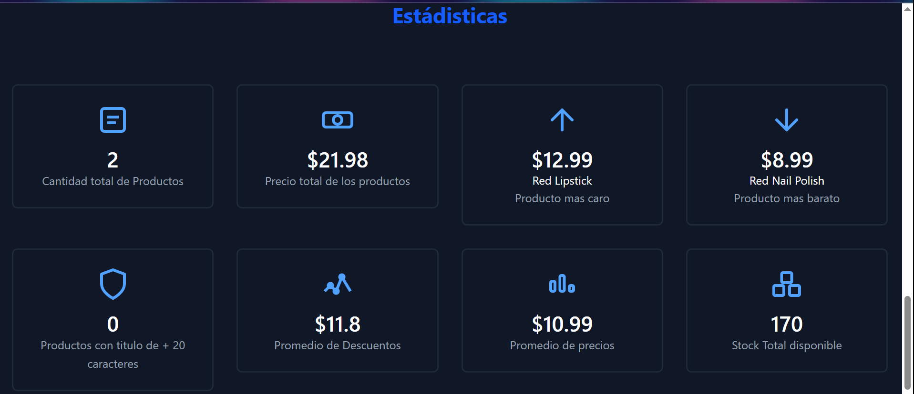

# Proyecto Integrador

* Alumno: Palomeque Jonathan
* Carrera: Tecnicatura Superior en Ciencia de datos e IA
* Institución: Instituto Superior Politécnico Córdoba (ISPC)
* Año: 2025

---
## Evidencia n°1:
### Cómo ejecutar este proyecto

1. Clonar el repositorio:
   git clone https://github.com/manuelpalomeque/ProyectoIntegrador-ISPC

2. Ir a la carpeta del proyecto:
   cd ProyectoIntegrador-ISPC

3. Instalar dependencias:
   npm install

4. Ejecutar la aplicación:
   npm run dev

### Vista previa del proyecto

## Evidencia n° 2:

### Explicación de las estadísticas y estructura de componentes

#### Estadísticas agregadas:

Se incorporaron estadísticas que permiten visualizar información relevante sobre los datos filtrados y totales. Entre las estadísticas principales se encuentran:
- **Cantidad total de productos**: Indica el número total de productos que cumplen con el criterio de búsqueda actual. Se calcula contando la cantidad de elementos en el arreglo filtrado.
- **Promedio de Precios**: Muestra el valor promedio de los precios de los productos filtrados. Se obtiene sumando los precios de todos los productos filtrados y dividiendo ese total por la cantidad de productos.
- **Stock total disponible**: Representa la suma total de unidades disponibles (stock) de todos los productos filtrados. Se calcula sumando el stock de cada producto que cumple con el filtro de búsqueda.

Estas estadísticas se actualizan automáticamente al aplicar filtros de búsqueda.

#### División del código en componentes

La aplicación está organizada en los siguientes componentes principales:

- **Content**: Este componente muestra un encabezado de presentación con tus datos personales y un enlace a mi perfil de GitHub. Sirve como introducción.

- **ProductList**: Se encarga de renderizar la información de cada producto filtrado. Por cada producto, muestra la categoría, título, descripción, dimensiones (ancho y alto), cantidad en stock, precio y una imagen representativa. Esto permite visualizar de forma detallada cada elemento de la lista.

- **StatsPanel**: Recibe como propiedades todas las estadísticas calculadas y las muestra de manera visual y ordenada. Entre las estadísticas presentadas se encuentran: cantidad total de productos, precio total, producto más caro y más barato (con su nombre), cantidad de productos con títulos largos, promedio de descuentos, promedio de precios y stock total disponible. Cada estadística se presenta en una tarjeta con íconos y estilos diferenciados para facilitar su interpretación.

Esta estructura modular facilita la reutilización del código, la separación de responsabilidades y el mantenimiento de la aplicación.